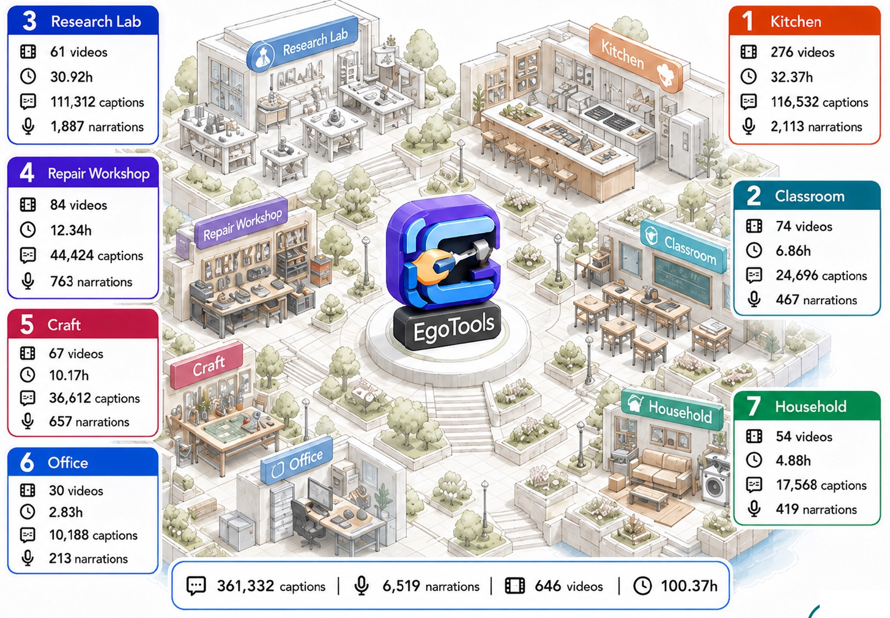
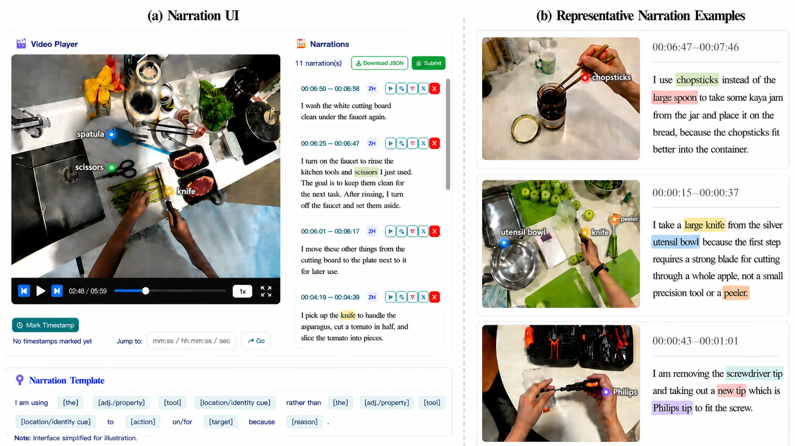

<div align="center">

<h1>
  <picture>
    <source media="(prefers-color-scheme: dark)" srcset="website/static/images/egotools-readme-logo-dark.svg">
    
  </picture>
</h1>
<h3>Towards Tool-Centric Reasoning<br>in Real-World Egocentric Videos</h3>

<p><strong>Official repository for the EgoTools paper</strong></p>

<p>
<a href="https://arxiv.org/abs/2609.39378"></a>
<a href="https://ropedia.github.io/egotools/"></a>
<a href="https://huggingface.co/datasets/ropedia-ai/egotools-data"></a>
<a href="https://huggingface.co/ropedia-ai/egotools-8b"></a>
<a href="https://ropedia.github.io/egotools/world/"></a>
</p>

**[Introduction](#introduction) · [Overview](#overview) · [Data & Benchmark](#data--benchmark) · [Quick Start](#quick-start) · [Training](#training) · [Citation](#citation)**

</div>

---

<p align="center">
  
  <br>
  <em>Seven domains. Real-world tool use.</em>
</p>

## Introduction

**EgoTools** is a suite for understanding how people **select, use, and reason about tools** in real-world egocentric videos. It brings together **646 videos spanning approximately 100 hours**, dense hierarchical annotations, long-horizon spatial grounding, and a diagnostic tool-use benchmark.

## Overview

- **EgoTools-Data** provides **361,332 hierarchical captions** and **6,519 tool-centric narrations**, connecting visible actions to tool choice, purpose, and state change.
- **EgoTools-Bench** contains **1,000 eight-choice questions** across four reasoning tracks, from recognizing a tool's role to understanding procedures and spatial relations.
- **EgoTools-8B** adapts Qwen3-VL-8B-Instruct using **184,679 instruction examples**, with training and evaluation separated at the source-video level.

<p align="center">
  
  <br>
  <em>From what is happening to which tool is used, why it is chosen, and how it changes the task.</em>
</p>

## Data & Benchmark

EgoTools covers **kitchen, classroom, research lab, repair workshop, craft, office, and household** environments. The benchmark evaluates four complementary abilities:

| Track | Focus |
| :--- | :--- |
| **AC · Affordance & Causality** | Tool suitability, substitutions, and the consequences of tool-mediated actions |
| **PG · Perception & Grounding** | Tools, interaction targets, attributes, and observable states |
| **PD · Procedural Dynamics** | Action order, task progression, and changes over time |
| **SR · Spatial Reasoning** | Spatial relations among hands, tools, and objects |

Evaluation needs one `manifest.tsv`: relative video paths, questions, options `A`–`H`, answers, and stable question/source identifiers. Media and model checkpoints are downloaded separately.

**[Data format & downloads](docs/DATA.md) · [Annotation & benchmark construction](docs/DATA_PROCESSING.md) · [Resource configuration](configs/resources.yaml)**

The published **[EgoTools-Data](https://huggingface.co/datasets/ropedia-ai/egotools-data)** repository contains recording assets; benchmark question tables and training SFT exports are separate inputs. The [data guide](docs/DATA.md) describes the available files, **[EgoTools-8B](https://huggingface.co/ropedia-ai/egotools-8b)** access, and earlier runnable bundles.

## Quick Start

### Installation

Run Qwen3-VL-8B on a benchmark manifest and its videos. The [data guide](docs/DATA.md) describes the manifest format, resource locations, and historical downloads. The setup below requires **conda and a CUDA-capable GPU** and installs the evaluation environment:

```bash
git clone https://github.com/Ropedia/egotools.git
cd egotools
bash scripts/setup_eval.sh
conda activate egotools_eval
```

### Evaluation

Prepare your downloaded data and run inference with **64 sampled frames**:

```bash
egotools-prepare-benchmark \
  --manifest /path/to/manifest.tsv --assets /path/to/media \
  --output data/benchmark

CUDA_VISIBLE_DEVICES=0 egotools-evaluate \
  --dataset-root data/benchmark \
  --model Qwen3-VL-8B-Instruct --nframe 64 \
  --results-dir outputs/qwen3-vl-8b
```

If the dataset already contains `manifest.tsv` and its referenced media, pass that directory directly to `--dataset-root`. Add `--limit 10` for a small inference run. For the paper's fine-tuned model, use `--model EgoTools-8B --model-path /path/to/checkpoint`; this retains the 64-frame protocol and labels the results as EgoTools-8B.

Results are written to `outputs/qwen3-vl-8b/<run-id>/results.json` with overall accuracy, answer-extraction coverage, and accuracy by question type and research track. Model responses remain in the VLMEvalKit prediction table.

Defaults follow the paper: EgoTools-8B and instruct baselines use 64 frames, Qwen3-VL Thinking uses 512, and Gemini uses video at 1 FPS. The [evaluation guide](docs/EVALUATION.md) explains audio inputs, alternate environments, distributed inference, and scoring.

## Training

The reference recipe fine-tunes the **language-model component of Qwen3-VL-8B** while freezing the vision encoder and multimodal aligner. Set up the [training environment](docs/TRAINING.md#environment), which installs MS-Swift at the paper run's revision with the EgoTools video-entry patch, download the [final training data](docs/TRAINING.md#final-training-data), and launch the eight-GPU recipe from the data root:

```bash
python3.10 -m venv .venv-train && source .venv-train/bin/activate
bash scripts/setup_train.sh
egotools-download training --output-dir data/egotools-sft

cd data/egotools-sft
CUDA_VISIBLE_DEVICES=0,1,2,3,4,5,6,7 NPROC_PER_NODE=8 \
bash ../../scripts/train.sh \
  --dataset train_184679.swift.jsonl \
  --output-dir ../../outputs/egotools-8b
```

The [evaluation](docs/EVALUATION.md#validation-scope) and [training](docs/TRAINING.md#validation-scope) guides record the measured runtime checks. The complete paper experiments have not yet been reproduced with the released resources.

## Citation

If you use EgoTools in your research, please cite:

```bibtex
@misc{tian2026egotools,
  title = {{EgoTools}: Towards Tool-Centric Reasoning in Real-World Egocentric Videos},
  author = {Tian, Shulin and Kim, Junsu and Liu, Shuai and Li, Hao and Shen, Yujiao and
            Li, Sihan and Yang, Zhe and Kim, Yeongon and Li, Feiyu and Wu, Jialin and
            Zhang, Yichi and Wang, Wenhui and Yao, Runmao and Dong, Yuhao and Chen, Zhaoxi and
            Hong, Fangzhou and Furnari, Antonino and Yang, Jingkang and Zhu, Hongyuan and Liu, Ziwei},
  year = {2026},
  eprint = {2609.39378},
  archivePrefix = {arXiv},
  primaryClass = {cs.CV},
  doi = {10.48550/arXiv.2609.39378},
  url = {https://arxiv.org/abs/2609.39378}
}
```

## Acknowledgments

We thank the authors and maintainers of [Qwen3-VL](https://github.com/QwenLM/Qwen3-VL), [MS-Swift](https://github.com/modelscope/ms-swift), and [VLMEvalKit](https://github.com/open-compass/VLMEvalKit). Their projects support the training and evaluation workflows in this repository.

The project license is pending. Upstream components retain their respective licenses; see [Third-party software](docs/THIRD_PARTY.md).
